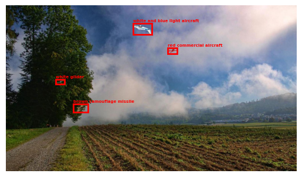
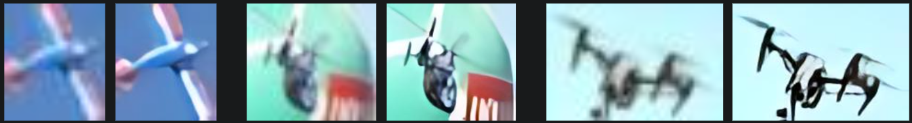

# DSTA BrainHack TIL-AI 2024

## Team 12000SGDPLUSHIE

## Introduction
TIL-AI 2024 has 3 tasks: Automatic Speech Recognition (ASR), Natural Language Processing (NLP) and Visual Language Modeling (VLM).

ASR task is to convert radio-distorted and noisy audio into text. NLP task is to convert text into structured data for controlling a turrent. VLM is to locate a flying object in an image based on its description. The three tasks chains up in Finals to drive a DJI Robomaster's turrent in an simulated environment.

## Team Members (in alphabetical order)
* [Billy Cao](https://github.com/aliencaocao) (L): NLP/VLM
* [Ho Wing Yip](https://github.com/HoWingYip): VLM
* [Huang Qirui](https://github.com/hqrui): ASR
* [Marcus Wee](https://github.com/Marcushadow): ASR
* [Ooi Xuan Shan](https://github.com/ooixs): VLM

## Achievements
* 3rd overall in Qualifiers
* 2nd in Semi-finals
* 7th in Finals

Unfortunately our model may have overfitted to leaderboard hidden test set in Finals, resulting in a lower ranking.

## Final evaluation results on leaderboard
| Task | Model                                                 | Accuracy Score     |
|------|-------------------------------------------------------|--------------------|
| ASR  | Whisper Medium                                        | 0.9956923723471317 |
| NLP  | gorilla-openfunctions-v2                              | 0.99933333         |
| VLM  | YOLOv6-L6 + RealESRGAN-x4v3 + SigLIP-large-patch16-384 | 0.913              |

We do not report speed score here as it is not optimal in leaderboard submission since we employed hardware-specific optimizations. More details will be below.

## ASR
### Data Augmentation

We tried introducing noise to the dataset, and train on the DSTA set with noise combined with that without noise. However, the model trained on denoised data was not performing very well, with an unexpected noticeable dip in accuracy. Hence, we scraped the idea of training on denoised data.

For ASR data augmentations, we decided to use the `audiomentations` library. We do note that the `torch-audiomentations` is also an alternative that better utilises the GPU. Nonetheless, the `audiomentations` library still offered us a wider variety of augmentations, allowing us to train our ASR models to be more robust to different types of noise.

Below is a set of augmentations that worked well for us initially:

```python
augment = Compose([
    HighShelfFilter(max_gain_db=6.0, p=0.3),
    LowShelfFilter(max_gain_db=6.0, p=0.3),
    TimeStretch(min_rate=0.9, max_rate=1.1, p=0.2),
    BandPassFilter(p=0.3)
])
```

#### [High Shelf Filter](https://iver56.github.io/audiomentations/waveform_transforms/high_shelf_filter/)

Attenuates or boosts the higher end of frequencies. We decided to boost the effect of higher frequencies by up to 6.0 decibels in our training data.

#### [Low Shelf Filter](https://iver56.github.io/audiomentations/waveform_transforms/low_shelf_filter/)

Attenuates or boosts the lower end of frequencies. We decided to boost the effect of lower frequencies by up to 6.0 decibels in our training data

#### [Time Stretch](https://iver56.github.io/audiomentations/waveform_transforms/time_stretch/)

Change the speed or duration of the signal without changing the pitch. We decided to limit the rate between 0.9 and 1.1 to avoid distortion of the audio clips beyond human recognition.

#### [Band Pass Filter](https://iver56.github.io/audiomentations/waveform_transforms/band_pass_filter/)

Attenuates the low and high frequencies of an audio clip, which can help to simulate radio transmission which only allows certain frequencies to be broadcasted.

"niner" is a special token that only exists in this competition's data due to the convention of radio transmission. We tried adding it as an extra token to the tokenizer. There are marginal gains but it introduced issues for faster-whisper deployment so we did not pursue.

### Model

| Model                 | Train Set                  | Leaderboard Score |
|-----------------------|----------------------------|-------------------|
| Whisper Small         | DSTA set                   | 0.9935            |
| Whisper Small         | DSTA set (Augs)            | 0.9940            |
| Whisper Small         | DSTA set + denoised        | 0.9922            |
| Whisper Small (niner) | DSTA set + denoised        | 0.9926            |
| Whisper Medium        | DSTA set (Augs)            | 0.9957            |
| Parakeet RNNT 0.6B    | DSTA set (Augs)            | 0.9687            |
| Parakeet RNNT 0.6B    | DSTA set + denoised (Augs) | 0.9893            |

Parakeet RNNT 0.6B gave a much worse leaderboard score despite a ~10x lower validation word error rate during training. Perhaps, Whisper has supreme robustness due to being trained on 680k hours of labelled data versus Parakeet's 64k hours.

More evaluation results can be found [here](asr/README.md).

### Training

Training was conducted locally on our own machines, namely 

Hyperparameters:

* Learning Rate: 1e-5
* warmup: 500 steps
* epochs: 30
* adam_beta1: 0.9
* adam_beta2: 0.98
* warmup_ratio: 0.22
* weight_decay: 1e-4

Training code can be found in [WhisperSmallAndMed.ipynb](asr/whisper-src/WhisperSmallAndMed.ipynb).


### Inference
To speed up inference using whisper models, we decided to use [`faster-whisper`](https://github.com/SYSTRAN/faster-whisper), which utilises the ctranslate2, a fast inference engine for Transformer models, to increase the inference speeds by more than 2x.

We also tried applying loudness normalisation to the audio clips before inference to increase accuracy score, and this was done using the [`pyloudnorm`](https://github.com/csteinmetz1/pyloudnorm) library. However, this loudness normalisation seemed to have no noticeable effect on our scores, but significantly slowed down model inference. This led us to conclude that our ASR models, namely whisper small and whisper medium, are already significantly robust to audio clips of varying loudness. This can also be seen in the physical competition where the raw whisper models were able to transcribe even the softess of clips in the advanced final round. 

We also tried denoising the data prior to inference as another attempt to raise our accuracy from the whisper model. However, we noticed early on that denoising the audio clips on inference was doing a disservice to the whisper model. Denoising on inference caused our accuracy to take a hit, while the performance tanked due to the time required to process every input. This is also likely due to whisper being trained on 680k audio clips and being robust to noise. It is also possible that denoising the clips, introduced audio artifacting in some clips and causing inferences to fail.

Inference code can be found in [ASRManager.py](asr/whisper-src/src/ASRManager.py).

## NLP
The task is to convert instructions on operating a turret into structured data with the following fields: heading (a 3-digit number), tool (the weapon to use), target (description of the target's color and type).

We approached the task as a function calling task common in LLM agents. We are aware of much smaller scale/faster pipelines available but decided to go the most time saving way of "whacking" a large model to solve everything so we can focus on the hard VLM task.
### Data Transformation
System prompt: `Convert the given instruction to turret into a function call to the control_turret function. Strictly ONLY one call is needed. If there are multiple instructions, use the FIRST one only.`

Function calling task require a function definition to be provided to the LLM, in JSON string and appended to the system prompt. After tuning by evaluating zero-shot on training data, ours is:
```json
{'name': 'control_turret',
'description': 'Control the turret by giving it heading, tool to use and target description',
'parameters': {'type': 'object', 'properties': {'heading':
{'type': 'string', 'description': 'Heading of target in three arabic numbers and multiples of five (005 to 360). Give None if not specified.'},
'tool': {'type': 'string', 'description': 'Tool to use or deploy. Give None if not specified.'},
'target': {'type': 'string', 'description': "Description of the target or enemy, exclude any quantifiers like 'the' or 'a'. It is a phrase that describe the appearance of the target like its color and type. Include ONLY the appearance and NOTHING else like its heading. Give None if not specified."}},
'required': ['heading', 'tool', 'target']}}
```

As sometimes the command can contain reputations and model can be confused, we did the following:
1. Check for “repeat” in text and attempt to extract information on first half, retry on full text if failed to extract all 3 fields. When retrying, omit the `Give None if not specified.` part of the prompt.
2. Any matched tool will be included in prompt so model do not choose it again as target (e.g. missiles)

To further reduce inference time, simple regex-based rules were used:
1. Regex to match 3-word sequence of heading e.g. "One One Zero"
2. Regex to match 7 known weapons in training data: `{'anti-air artillery', 'drone catcher', 'electromagnetic pulse', 'emp', 'interceptor jets', 'machine gun', 'surface-to-air missiles'}`

### Model
[Gorilla-OpenFunctions-v2](https://gorilla.cs.berkeley.edu/blogs/7_open_functions_v2.html) by UC Berkely, SOTA open-source model on [Berkeley Function-Calling Leaderboard](https://gorilla.cs.berkeley.edu/leaderboard.html), fine-tuned from LLaMA2-7B.

Using the above data transformations, the pretrained model scored 0.9978597402597402 on leaderboard.

More evaluation results can be found [here](nlp/README.md).

### Training
We then fine-tuned the model using [Unsloth](https://github.com/unslothai/unsloth). Training took 34 minutes on Colab's free T4 GPU. We used [Rank-Stabilized](https://arxiv.org/abs/2312.03732) [LoRA (Low-Rank Adaptation of Large Language Models)](https://arxiv.org/abs/2106.09685).
#### Hyperparameters:
* LoRA rank: 16
* LoRA alpha: 16
* optimizer: AdamW 8bit
* initial LR: 2e-4
* warmup: 10 steps
* LR schedule: cosine annealing decay
* effective batchsize: 8
* epoch: 1
* weight decay: 0.01

Training code can be found in [train.ipynb](nlp/src/train.ipynb).

### Inference
LLMs may seem extreme for this task for its sheer size and inference cost, but it CAN be deployed efficiently with inference costs matchihng smaller models like BERT.

We used [ExLlamaV2](https://github.com/turboderp/exllamav2) quantization and inference engine. It was chosen because it does all matrix ops in FP16 which Tesla T4 GPU in submission runtime excels at. It is also specifically optimized for consumer Nvidia GPU which is used in the Finals (RTX 4070Ti Super).

Our model was quantized to average of 5.0 bit with 6-bit head precision, using default calibration data. Anything below 5.0 bit severely reduces model performance even with custom calibration data.

We made tweaks to further reduce VRAM I/O bottlenecks to speed up inference:
* Discard logits in VRAM instead of copying back to CPU (2x+ speedup), controlled by `config.max_output_len = 1`
* restricting KV cache pool to short context length (512) and batch size (4 in qualifiers, 1 in finals), controlled by `config.max_seq_len = 512` and `config.max_batch_size = 4`

Our trained model has 0.9993333333333333 leaderboard score without any tricks / regex mentioned above, just to test fine-tuning effectiveness. In finals, we still employ those tricks.

Model peak VRAM usage: 5.7GB

Time taken to process 1 sample at bs=1: 0.36s. With bs=4, it is about 2 times faster per sample.

Inference code can be found in [NLPManager.py](nlp/src/NLPManager.py).


## VLM
This task is on using description of a flying object to locate it in an image. We tried multiple approaches:
* MM-Grounding-DINO: trained model giving 0.509 map (we got scammed)
* Co-Det: 0.61 map zero-shot but too slow to train
* OWLv2-large-ensemble: 0.629 map zero-shot BUT training on both own-implemented PyTorch code and Google’s Official JAX code lead to loss explosion
* A few that inference could not run / already very bad on training data
  * APE (RAM OOM)
  * UNINEXT
  * ONE-PEACE
  * OFA
  * GLEE-Pro
  * PolyFormer
  * HIPIE
  * LLaVA 1.6 (LLaMA-3 8B) w/ prompting
  * Phi3-vision w/ prompting

Details can be found [here](vlm/README.md)

We only document in detail the multi-stage approach that we used eventually here.
### Overview
1. YOLOv6-L6 trained on single-class detection of targets in general, using synthetic data too
2. Extract the bboxes as detected by YOLO, optionally using SAHI (Slicing Aided Hyper Inference). SAHI helped for v9e but not v6l6.
3. Run each extracted bbox through Real-ESRGAN x4v3 model to upscale 4x
4. Feed each bbox into a SigLIP and get similarity score VS caption (1/image)
5. Choose the box with the highest similarity score for each caption

#### Note on SAHI
SAHI slices our 870x1520 image into 6 870x760 slices. Initially we hypothesised that YOLOv6, having been fine-tuned only on 870x1520 images, may have been ill-suited for inference on sliced images of the new size. As such, we fine-tuned a second YOLOv6-L6 on randomly chosen 870x760 slices of each input image. However, this did not improve performance.

YOLOv6 sliced training may be enabled by setting `self.sahi_random_crop = True` [here](vlm/train/YOLOv6/YOLOv6/yolov6/data/datasets.py#L128).

### Data Augmentation
#### YOLO
We used the following augmentations for YOLOv9e and YOLOv6-L6 training:
```python
T = [
    A.GaussNoise(var_limit=2500, p=0.5),
    A.ISONoise(p=0.5),
    A.Flip(p=0.5),
    A.Blur(p=0.1),
    A.MedianBlur(p=0.1),
    A.ToGray(p=0.1),
    A.CLAHE(p=0.1),
    A.RandomBrightnessContrast(p=0.5),
    A.RandomGamma(p=0.2),
    A.ImageCompression(quality_lower=75, p=0.5),
]
```
This is V3 of the augmentations. Evaluation of previous 2 versions can be found [here](vlm/multistage/README.md).

Note for YOLOv9e, we had to modify the [source](https://github.com/ultralytics/ultralytics/blob/c8514a6754d22a331e600ea9236340d40477b8a5/ultralytics/data/augment.py#L928) of Ultralytics directly to modify its augmentations.

Augmentations for YOLOv6 are defined [here](vlm/train/YOLOv6/YOLOv6/yolov6/data/datasets.py#L116).

#### SigLIP
We used the following augmentations for SigLIP training:
```python
T = [
    A.Resize(image_size, image_size, interpolation=cv2.INTER_LANCZOS4),
    A.GaussNoise(var_limit=(500, 5000), p=1.0, per_channel=True),
    A.ISONoise(p=1.0, color_shift=(0.02, 0.07)),
    A.MultiplicativeNoise(p=1.0),
    A.AdvancedBlur(blur_limit=(3, 11), p=0.3),
    A.Flip(p=0.5),
    A.RandomRotate90(p=0.5),
    A.CLAHE(p=0.2),
    A.RandomBrightnessContrast(brightness_limit=0.2, contrast_limit=0.5, p=0.5),
    A.RandomGamma(p=0.2),
    A.Perspective(p=0.5),
    A.ImageCompression(quality_range=(25, 75), p=0.8),
    A.Normalize(mean=mean, std=std),
    ToTensorV2()
]
```
This is V2 of the augmentations. Evaluation of V1 can be found [here](vlm/multistage/README.md).

### Synthetic Data
We generated synthetic data for VLM task by cropping and pasting flying objects from online onto random images, and resizing them and add augmentations.

Our synthetic data consists of 2338 images, 9214 bboxes, 69 unique objects.

Code for generating the dataset can be found [here](vlm/create_and_augment_new_data.ipynb)

Sample:




### Models
#### Object Detectors
We initially used [YOLOv9e](https://docs.ultralytics.com/models/yolov9/) for qualifiers, then switched to [YOLOv6l6](https://github.com/meituan/YOLOv6) as we find it perform better both on our synthetic data and leaderboard, while being 3x faster to train and 2x faster to infer. It also converges with 2x less epoch (~30 VS ~70 on V9e).

Best leaderboard score for YOLOv9e is 0.905 with SAHI and TTA (slow). Best leaderboard score for YOLOv6l6 is 0.911 for single-model, 0.913 for 2x YOLOv6l6 WBF, but both without SAHI/TTA. In finals, we used single model in favour of speed.

#### Upscalers
We used [Real-ESRGAN](https://github.com/xinntao/Real-ESRGAN) x4v3 for upscaling. It is a very lightweight model at 6.2MB. While larger models like RealESRNet_x4plus are better, they are too slow to run inference, since the model cannot be batched without padding (which severely hurts its quality). In local evaluations, the lightweight version performed just as well.

Effect of upscaling:



More evaluation results and analysis on different models can be found [here](vlm/multistage/README.md).

### Training
#### YOLOv9e
* YOLOv9e trained on 640px input size with augmentations
* Inferencing at 1600px improves score despite model trained at 640px
* Continued training for ~10 epoches on 1600px improves further

YOLOv9e training code can be found in [train.ipynb](vlm/multistage/yolov8/train.ipynb)

#### YOLOv6-L6

To launch YOLOv6-L6 training, run the following:
```sh
cd vlm/multistage/YOLOv6
CUDA_VISIBLE_DEVICES=0,1,2,3,4 python -m torch.distributed.launch \
    --nproc_per_node 5 \
    --master_port 27322 \
    tools/train.py \
    --batch-size 52 \
    --bs_per_gpu 16 \
    --conf-file configs/yolov6l6_finetune.py \
    --data-path data/dataset.yaml \
    --specific-shape \
    --height 870 \
    --width 1520 \
    --epochs 200 \
    --eval-final-only \
    --save_ckpt_on_last_n_epoch 200 \
    --output-dir runs/train \
    --name bs52_effbs64_dsta+xs_expanded \
    --device 0,1,2,3,4 \
    --workers 32 \
    --check-images \
    --check-labels
```

#### SigLIP

SigLIP training code can be found in [HF_train.py](vlm/multistage/siglip/HF_train.py)

SigLIP training logs on Weights & Biases: https://wandb.ai/aliencaocao/TIL2024-SigLIP

Semi-finals submission model is https://wandb.ai/aliencaocao/TIL2024-SigLIP/runs/3c00nigo which is resumed from https://wandb.ai/aliencaocao/TIL2024-SigLIP/runs/os657bxe

Finals submission model is https://wandb.ai/aliencaocao/TIL2024-SigLIP/runs/ffkw9nka


### Inference
#### YOLOv9e
* Test-time Augmentation improves score at cost of inference speed
* SAHI (Slicing Aided Hyper Inference) improves significantly at large cost of speed: (0.896 → 0.905)

#### Slicing Aided Hyper Inference (SAHI)
We modified the original [SAHI](https://github.com/obss/sahi) to:
1. Add support for batched inference on slices to greatly speedup inference
2. Add support for TensorRT for Ultralytics-based/originally YOLOv8 models (exported using Ultralytics)
3. Add support for YOLOv6 (requires yolov6 repo on sys.path)

Our modified fork is [here](https://github.com/aliencaocao/sahi).

#### YOLOv6l6

#### Real-ESRGAN-x4v3

#### SigLIP

Time taken to process 1 sample at bs=1: 0.15s. Without TensorRT acceleration, it takes 1.8s.